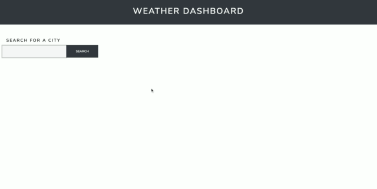

# WeatherDashboard

# Quiz-Game

This application is designed to allow a user to select the city of his or her choice and be presented with dynamically populating results.

Once a city has been searched for, it appears under the search bar, where it can be referenced again at a future time.

## Interface

This dashboard is purposefully designed to be simple to use. The user has only three options-- to search for a new city by typing it in the text area, to click on a city for which they previously searched, or to delete a city from the previous search section.

## Known Issues
Unfortunately, the app still has some bugs. Deleting a city can be problematic—— sometimes only working once the page has been refreshed—— and the list of past searches often doesn't completely carry over after a page refresh.

## Technologies

This site was written using:

* Bootstrap 4
* Javascript/JQuery
* AJAX

## Credits

I used the [openweathermap API](https://openweathermap.org/api) to populate the weather information this page uses.

In setting up this project, I closely followed the guidelines provided by the [UCF Coding Bootcamp](https://github.com/UCF-Coding-Boot-Camp/UCF-ORL-FSF-FT-11-2019-U-C).
